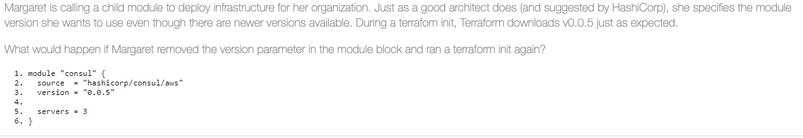

<h1 style='color:yellowgreen'>summary Tips from exams</h1>


<h3 style="color:yellowgreen">
- Usage: terraform console [options]
</h3>
This command provides an interactive command-line console for evaluating and experimenting with expressions. This is useful for testing interpolations before using them in configurations, and for interacting with any values currently saved in state.

<h3 style="color:yellowgreen">
provider syntax
</h3>
remember the syntax it's providers not provider

`terraform { required_providers {aws = ">=2.7.0"} }`

<h3 style="color:yellowgreen">where does terraform save the modules files</h3>

`.terraform/modules`

<h3 style='color:yellowgreen'>TF_LOG</h3>
TF_LOG levels are TRACE,DEBUG,INFO,WARN,ERROR,
TRACE is the most verboseand it is the default if TF_LOG is set to something other than a log level name.
to turning it of use TF_LOG=""

<h3 style='color:yellowgreen'>aws_eip</h3>
the aws_instance will be created first and then aws_eip will be created second due to the aws_eip's resource dependency of the aws_instance id

[https://learn.hashicorp.com/tutorials/terraform/dependencies](https://learn.hashicorp.com/tutorials/terraform/aws=dependency)

<h3 style='color:yellowgreen'>signs</h3>
when you are trying to apply something
the prefix +/- means that Terraform will destroy and recreate the resource rather than updating it in place. some attributes and resources can be updated i-place and are shown with the ~ prefix.

<h3 style='color:yellowgreen'>Terraform needs credentials</h3>
there are several different ways to configure credentials.

- integrated services, such as AWS IAM or Azure Managed Service Identity
- use environments variable
- directly in the provider block by hardcoding or using a variable

<h3 style='color:yellowgreen'>three provider in a question </h3>
look at the question below. and where will the resource be provisioned ?


the resource above will be created in the default region of us-east-1. since the resource does signify and alternative rpovider configuration. if the resource needs to be created in one of the other declared regions. it hsould have looked like this, where aws signifies the provider name and "west" signifies the alias name as such

```
    resource "aws_instance" "vault"{
        provider = aws.west
        instance_type= "t3.micro"

        and so on !!
    }

```

<h3 style='color:yellowgreen'>Multiple Provider Configurations</h3>

You can optionally define multiple configurations for the `same provider` , and select which one to use on a per-resource or per-module basis. The primary reason for this is `to support multiple regions` for a cloud platform; other examples include targeting multiple Docker hosts, multiple Consul hosts, etc.

alias purpose in Terraform :
using the same provider with different configuration for different resources.

[https://www.terraform.io/language/providers/configuration](https://www.terraform.io/language/providers/configuration)

```
    # The default provider configuration; resources that begin with `aws_` will use
    # it as the default, and it can be referenced as `aws`.
    provider "aws" {
    region = "us-east-1"
    }

    # Additional provider configuration for west coast region; resources can
    # reference this as `aws.west`.
    provider "aws" {
    alias  = "west"
    region = "us-west-2"
    }

```

🌟 <h3 style='color:red'>Provider dependencies</h3>

🌟 Provider dependencies are created in several different ways.

- explicit use of a provider block in configuration. optionally including a version constraint
- use of any resource belonging to particular provider in a resource or data block in the configuration
- existence of any resource instance belonging to particular provider in the current state

<h3 style='color:yellowgreen'>Hashicorp Style</h3>
 HashiCorp style conventions suggest you that align the equals sign for consecutive arguments for easing readability for configurations
 
 ami="abc123"
 andinstance_type ="t2.micro"
 [https://www.terraform.io/language/syntax/style](https://www.terraform.io/language/syntax/style)

<h3 style='color:yellowgreen'>why this option?</h3>
terraform {
    required_version = ">=0.12"
    }

You can use required_version to ensure that a user deploying infrastructure is using Terraform 0.12 or greater , due to the vast number of changes that were introduced. as a result, many previously written configurations had to be converted or rewritten.

<h3 style='color:yellowgreen'>Terraform plugins</h3>
when you run terraform init it goes and download plugins . where is the location of the plugins in your system?

By default, terraform init downloads plugins into a subdirectory of the working directory `.terraform/plugins`, so that each working directory is self-contained

<h3 style='color:yellowgreen'>environment variable</h3>
Environment variables can be used to set variables. the environment variables must be in the format TF_VAR_name and this will be checked last for a value for example:

```
export TF_VAR_region=us-west-1
export TF_VAR_ami=ami-12312312
export TF_VAR_alist='[1,2,3]'
export TF_VAR_amap='{foo="bar",baz="qux"}'
```

<h3 style='color:yellowgreen'>Hashicorp style</h3>

when writing Terraform code Hashicorp recommends that you use `2` spaces between each nesting level

<h3 style='color:yellowgreen'>Terraform provider</h3>
when you used a below code example

```
    terraform {

        required_providers{

        aws = "~>1.2.0"
        {
    }
```

it means , it will match any non-beta version of provider between >= 1.2.0 and <1.3.0 for example 1.2.X

[https://www.terraform.io/configuration/modules#gt-1-2-0-1](https://www.terraform.io/configuration/modules#gt-1-2-0-1)

<h3 style='color:yellowgreen'>Terraform lock file</h3>
what happen if multiple user attempt to run a terraform apply simultaneously when using a remote backend ?

if the state is configured for remote state, the backend selected will determine what happends. if the backedn support locking, the file will be locked for the first user , and the users's configuration will be applied . the second users;'s terraform applyu will return an error that the state is locked. if the remote backend does not support locking, the state file could become corrupted, since multiple users are trying to make changes at the same time

[https://www.terraform.io/language/state/locking](https://www.terraform.io/language/state/locking)

<h3 style='color:yellowgreen'>Terraform sensitive information</h3>
when ever you use these three methods, username/password will being written to the state file.

- useing a declared variable
- retrieving the credentials from a data source, such as HashiCorp Vault
- using a tfvars file

🌟 Environment vaiables can end up in log files if TF_LOG is set to TRACE.

<h3 style='color:yellowgreen'>Reconciling real-world drifts</h3>

Prior to a plan or apply operation, Terraform does a refresh to update the state file with real-world status. You can also do a refresh any time with` terraform refresh`:
what Terraform is doing here is reconciling the resources tracked by the state file with the real world. it does this by querying your infrastructure providers to find out what's actually running and the current configuration. and updating the state file with this new information.Terraform is designed to co-exist with other tools as well as manually provisioned resourcs and so it only refreshes resources under its management

<h3 style='color:yellowgreen'>Easy-Peasy</h3>

During a Terraform apply, any resources that are successfully provisioned are maintained as `deployed`. on the other hand resources that failed during the provisioning process such as provisioned will be `tainted` to be recreated during the next run. This

🌟 🌟 🌟 <h3 style='color:yellowgreen'>what if I remove the version of module and run terraform init again </h3>

]

terraform would use the existing module already downloaded.

<h3 style='color:yellowgreen'>Local in Terraform</h3>
A local Value assings a name to an expression, so you can use it multiple times within a module without repeating it.

```
locals {
  service_name = "forum"
  owner        = "Community Team"
}

locals {
  # Ids for multiple sets of EC2 instances, merged together
  instance_ids = concat(aws_instance.blue.*.id, aws_instance.green.*.id)
}

locals {
  # Common tags to be assigned to all resources
  common_tags = {
    Service = local.service_name
    Owner   = local.owner
  }
}


resource "aws_instance" "example" {
  # ...

  tags = local.common_tags
}

```

<h3 style='color:yellowgreen'>remove resource from state manually </h3>

if you remove a resource from state manually with the `terraform state rm vsphere_virtual_machine.app1` and run terraform apply. the Terraform was no longer aware of the virtual machine and it refreshed the state file and discovered that the configuration file declared a virtual machine but it was not in state, there fore Terraform needed to create a virtual machin so the provisioned infrastructure matched the desired configuration. which is the Terraform configuration file.


[watch this video ](https://www.youtube.com/watch?v=7gO42TuioHc)


<h3 style='color:yellowgreen'>Terraform commands</h3>

`Terraform taint `command manually marks a Terraform-managed resource as tainted, forcing it to be destroyed and recreated on the next apply.
`Terraform workspace` select command is used to choose a different workspace to use further operations. 
`Terraform login` command can be used to automatically obtain and save an api token for Terraform Cloud, Terraform Enterprise , or any other host that offers Terraform services.


<h3 style='color:yellowgreen'>Terraform style</h3>
Lists are defined with [] and maps are defined with {}
it means like this 

```
type = list(string)
default = [] not {}
```

<h3 style='color:yellowgreen'>Terraform depends on </h3>
Terraform analyzes any expressions within a resource block to find references to other objects and treats those references as implicit ordering requirements when creating, updating or destroying resources.


<h3 style='color:yellowgreen'>retrieval of data</h3>
it is important to consider that Terraform reads from data sources during the plan phase and writes the result into the plan.For something like a Vault token wich has an explicit TTL the apply must be run before the data , or token, in this case, expires, otherwise, Terraform will fail during the apply phase.

